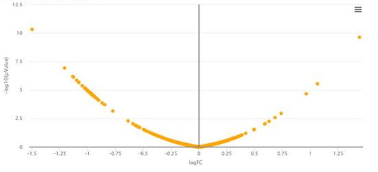

## FAQ table of contents

* [Why does the table in experimental design blink during edition?](#tablelinks)
* [How to build a valid experimental design?](#expdesign)
* [Why do the items of the contextual menus for plots remain 'undefined'?](#menus)
* [Why does my volcano plot look so aligned?](#volcano)
* [How to recover differential analysis results?](#recoverDA)

## Why does the table in experimental design blink during edition?
When you edit the experimental design (during converting a text file to MSnset or during the update of the design), it may happen that the cells begin to blink in a random order. Then, no more operation is possible in the table. This happens if you edit the cells too fast with respect to the table update speed. We apologize for this caveat : this is a known bug of the package used to provide the table. No patch is available yet. The only workaround is to close then reopen Prostar.

## How to build a valid experimental design?
In Prostar, the differential analysis is devoted is devoted to the processing of hierarchical unpaired experimental designs . However, in former versions, this was not explicit enough, so that users with paired samples could used Prostar with wrong assumptions. To clear this out, we have changed the experimental design construction step so that its explicitly appears unpaired.

As a result, the samples must now be numbered as in the following example:

Condition 1: 1 - 2 - 3 - 4,

Condition 2: 5 - 6 - 7 - 8

As opposed to:

Condition 1: 1 - 2 - 3 - 4,

Condition 2: 1 - 2 - 3 - 4

Which, depending on the context, could suggest that the 8 samples comes only from 4 different biological subjects, and thus leading to paired tests - for instance, patients that are compared between Before (Condition 1) and After (Condition 2) some treatment.

However, one should note that even if the experimental design now looks different, this is just due to a numbering convention, and the statistical test is not impacted.

## Why do the items of the contextual menus for plots remain 'undefined'?
This happens if the version of the package 'highcharter' is less or equal to 0.5.0. To fix this issue, you should install the devel version of the package by typing the following command in a R console: devtools::install_github('jbkunst/highcharter')

## Why does my volcano plot look so aligned?

In very uncommun situations, one may obtain a bowl shape volcano plot such as depicted above. This is due to using Limma on a dataset for which it is not adapted: Briefly, the numerical values in the quantitative matrix appears to have a repetitive pattern that prevent Limma routines to compute the number of degrees of freedom of the Chi2 distribution on which the protein variances should be fitted. As a result, Limma returns a result directly proportional to the fold-change, and the p-values are none-informative. In such cases, which are fortunately extremely odd, we advise to replace Limma test by a classical t-test.

### How to recover differential analysis results?
 From Prostar 1.14, the differential analysis results are not exported anymore when using the "Export fo file" functionality, regardless the format (MSnset, excel or zipped CSV). This is due to the separate management of the "data mining" and "data processing outputs. As a result, after performing the differential analysis, the results must be downloaded thanks to the devoted buttons (otherwise, they will be lost when closing the Prostar session). However, all the p-value computatations (from the "hypothesis testing" menu) can be exported and recover from one session to another one.
